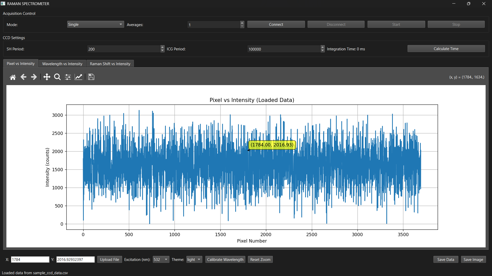
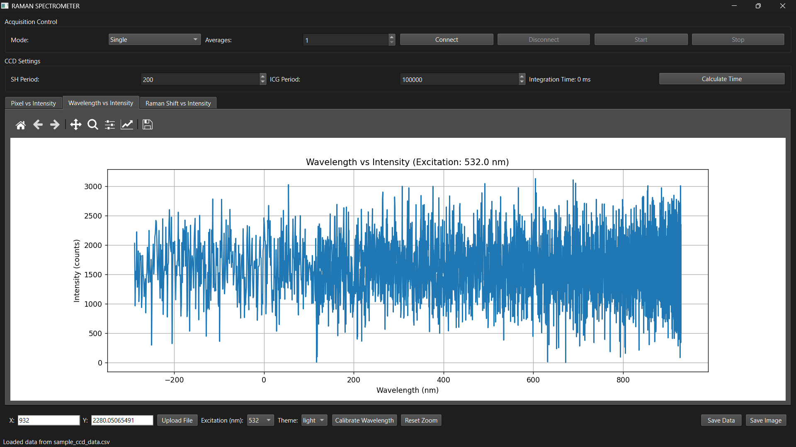
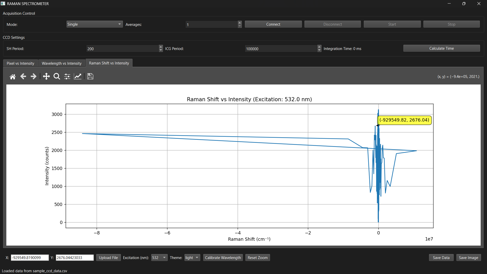

# RamanScope – Raman Spectrometer Control & Analysis Software

> A complete Windows application for controlling a CCD-based Raman spectrometer, performing wavelength calibration, visualizing spectra, and exporting data — all without needing a separate Python installation.

---

## 📥 Download
[**⬇ Download the latest release here**](https://github.com/KI-REPOS/Raman_Spectrometer/releases)

---

📖 Overview

RamanScope is designed to interface with an STM32-driven CCD Raman spectrometer.  
It enables **real-time acquisition**, **calibration**, and **analysis** of Raman spectra.  
The software includes an interactive GUI built with PySide6 and integrates matplotlib for dynamic plotting.

---

✨ Features

- **CCD Communication** – Connect via USB/Serial to STM32-based spectrometer.
- **Two Acquisition Modes** – Single scan or continuous mode.
- **Parameter Configuration** – Set SH period, ICG period, averages, and acquisition mode.
- **Three Graph Types**:
  - Pixel vs. Intensity
  - Wavelength vs. Intensity (post-calibration)
  - Raman Shift vs. Intensity
- **Graph Interactivity** – Zoom, pan, cursor coordinate tracking.
- **Wavelength Calibration** – Quadratic fit using known reference points.
- **Raman Shift Calculation** – Automatic based on excitation wavelength.
- **Data Management** – Save spectra as CSV/TXT or export images as PNG/SVG.
- **Theme Support** – Light and dark modes.

---

🖥️ System Requirements

- **OS**: Windows 10/11 (64-bit)
- **Hardware**: STM32-based CCD Raman spectrometer
- **Drivers**: Installed STM32 Virtual COM Port drivers
- **USB Connection**: For spectrometer communication

---

🚀 How to Use

1. Connect your spectrometer to the PC via USB.
2. Launch the `RamanScope.exe` file.
3. Click **Connect** to initialize the serial link.
4. Configure acquisition parameters (SH, ICG, averages).
5. Start acquisition and view spectra in real-time.
6. Perform wavelength calibration if needed.
7. Save data or export images for reports.

---

## 📷 Preview Images

| Pixel vs. Intensity | Wavelength vs. Intensity | Raman Shift vs. Intensity |
|---------------------|--------------------------|---------------------------|
|  |  |  |

---

## 💡 Author
Developed by **KIRANSURYAKUMAR K** – [GitHub Profile](https://github.com/KI-REPOS)
